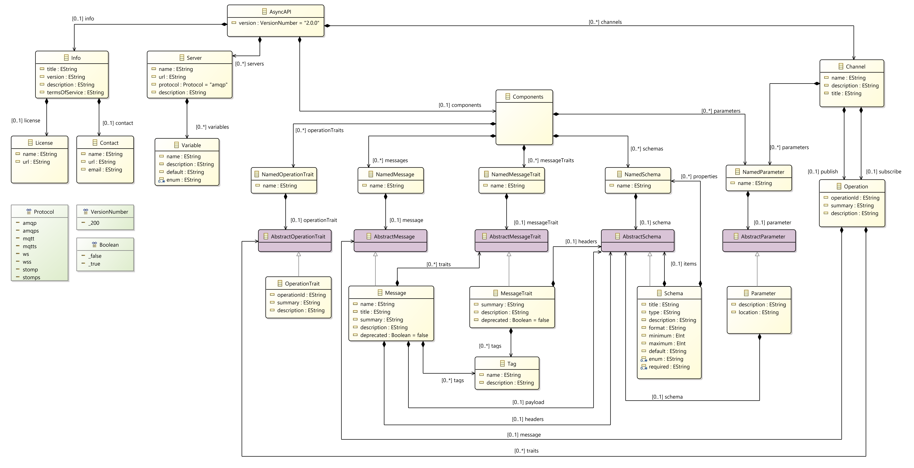
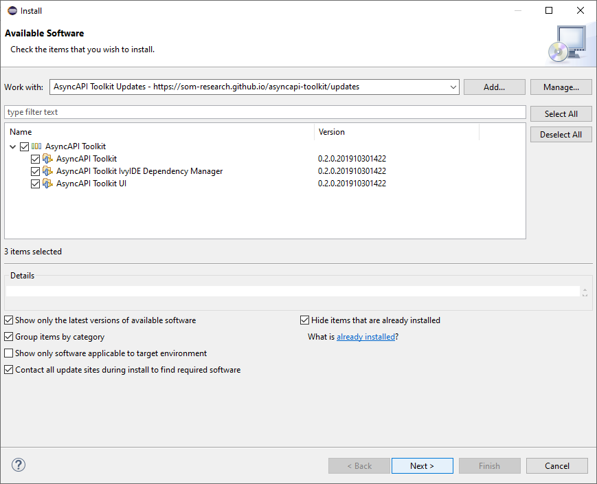
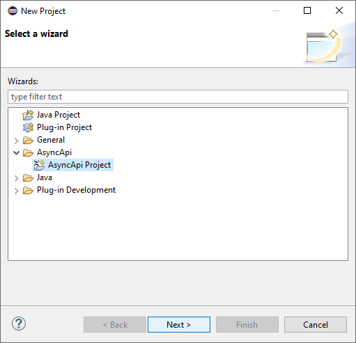
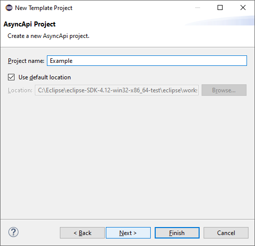
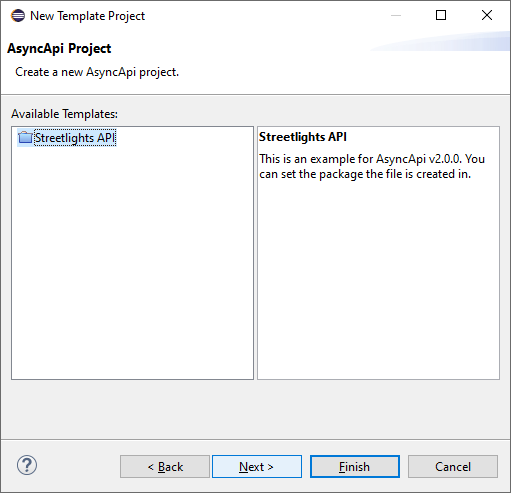
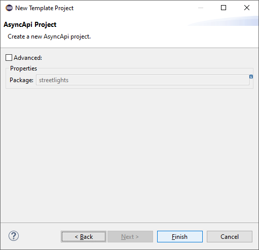
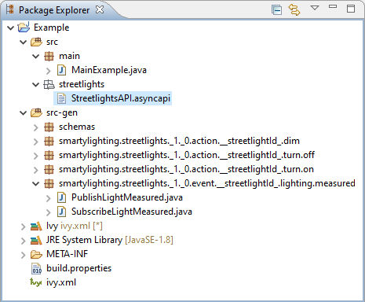

# AsyncAPI Toolkit
Repository to host the grammar, metamodel, and code generation tools for [AsyncAPI](https://www.asyncapi.com). 

> _AsyncAPI provides a specification that allows you to define Message-Driven APIs in a machine-readable format. It's protocol-agnostic, so you can use it for APIs that work over Kafka, MQTT, AMQP, WebSockets, STOMP, etc. The spec is very similar to OpenAPI/Swagger so, if you're familiar with it, AsyncAPI should be easy for you._

The tools hosted in this repository aim to provide the toolset necessary to develop Message-Driven APIs following a Model-based approach starting from AsyncAPI specifications.

## AsyncAPI Metamodel

Below you can find the simplified [AsyncAPI v2.0.0](https://www.asyncapi.com/docs/specifications/2.0.0/) Metamodel Derived from the AsyncAPI Xtext Grammar.



## Installation

To install the toolkit use the following update site:

> https://som-research.github.io/asyncapi-toolkit/updates

### Prerequisites

* The toolkit requires [Eclipse 4.12 (2019-06)](https://download.eclipse.org/eclipse/downloads/drops4/R-4.12-201906051800/) or [above](https://download.eclipse.org/eclipse/downloads/).
* A MQTT broker (e.g. [mosqutitto](https://mosquitto.org/download/)) is needed for the Example project to be executable.

## Quick Start Guide

To start using the toolkit, just install the plugins, using the previous Update site:



After installation is complete, a new wizard will appear in the `New Project` dialog:



Select _AsyncAPI Project_, set a project name, and continue.



After that, the _Streetlights API_ template project will appear. The _Streetlights API_ template contains a fully working example (provided a mqtt broker is running in localhost) demonstrating the capabilities of the framework.



Finally, the wizard can be completed.



After that, A new project with the following contents will appear in the workspace.



Pay special attention to the following files:

* `src/streetlights/StreetlightsAPI.asyncapi` is an example specification (see below) of an API using the JSON format of the AsyncAPI specification. Code in `src-gen` will be generated from the specification contained in this file.

```JSON
{
  "asyncapi": "2.0.0",
  "info": {
    "title": "Streetlights API",
    "version": "1.0.0",
       "description": "The Smartylighting Streetlights API allows you to remotely manage the city lights.\n\n### Check out its awesome features:\n\n* Turn a specific streetlight on/off 🌃\n* Dim a specific streetlight 😎\n* Receive real-time information about environmental lighting conditions 📈\n",
    "license": {
      "name": "Apache 2.0",
      "url": "https://www.apache.org/licenses/LICENSE-2.0"
    }
  },
  "servers": {
    "production": {
      "url": "localhost:{port}",
      "protocol": "mqtt",
      "description": "Test broker",
      "variables": {
        "port": {
          "description": "Secure connection (TLS) is available through port 8883.",
          "default": "1883",
          "enum": [
            "1883",
            "8883"
          ]
        }
      },
    }
  },
  "channels": {
    "smartylighting/streetlights/1/0/event/{streetlightId}/lighting/measured": {
      "description": "The topic on which measured values may be produced and consumed.",
      "parameters": {
        "streetlightId": {
          "$ref": "#/components/parameters/streetlightId"
        }
      },
      "subscribe": {
        "summary": "Receive information about environmental lighting conditions of a particular streetlight.",
        "operationId": "receiveLightMeasurement",
        "message": {
          "$ref": "#/components/messages/lightMeasured"
        }
      },
    "publish": {
        "summary": "Publish information about environmental lighting conditions of a particular streetlight.",
        "operationId": "sendLightMeasurement",
        "message": {
          "$ref": "#/components/messages/lightMeasured"
        }
      }
    },
    "smartylighting/streetlights/1/0/action/{streetlightId}/turn/on": {
      "parameters": {
        "streetlightId": {
          "$ref": "#/components/parameters/streetlightId"
        }
      },
      "publish": {
        "operationId": "turnOn",
        "message": {
          "$ref": "#/components/messages/turnOnOff"
        }
      }
    },
    "smartylighting/streetlights/1/0/action/{streetlightId}/turn/off": {
      "parameters": {
        "streetlightId": {
          "$ref": "#/components/parameters/streetlightId"
        }
      },
      "publish": {
        "operationId": "turnOff",
        "message": {
          "$ref": "#/components/messages/turnOnOff"
        }
      }
    },
    "smartylighting/streetlights/1/0/action/{streetlightId}/dim": {
      "parameters": {
        "streetlightId": {
          "$ref": "#/components/parameters/streetlightId"
        }
      },
      "publish": {
        "operationId": "dimLight",
        "message": {
          "$ref": "#/components/messages/dimLight"
        }
      }
    }
  },
  "components": {
    "messages": {
      "lightMeasured": {
        "name": "lightMeasured",
        "title": "Light measured",
        "summary": "Inform about environmental lighting conditions for a particular streetlight.",
        "payload": {
          "$ref": "#/components/schemas/lightMeasuredPayload"
        }
      },
      "turnOnOff": {
        "name": "turnOnOff",
        "title": "Turn on/off",
        "summary": "Command a particular streetlight to turn the lights on or off.",
        "payload": {
          "$ref": "#/components/schemas/turnOnOffPayload"
        }
      },
      "dimLight": {
        "name": "dimLight",
        "title": "Dim light",
        "summary": "Command a particular streetlight to dim the lights.",
        "payload": {
          "$ref": "#/components/schemas/dimLightPayload"
        }
      }
    },
    "schemas": {
      "lightMeasuredPayload": {
        "type": "object",
        "properties": {
          "lumens": {
            "type": "integer",
            "minimum": 0,
            "description": "Light intensity measured in lumens."
          },
          "sentAt": {
            "$ref": "#/components/schemas/sentAt"
          }
        }
      },
      "turnOnOffPayload": {
        "type": "object",
        "properties": {
          "command": {
            "type": "string",
            "enum": [
              "on",
              "off"
            ],
            "description": "Whether to turn on or off the light."
          },
          "sentAt": {
            "$ref": "#/components/schemas/sentAt"
          }
        }
      },
      "dimLightPayload": {
        "type": "object",
        "properties": {
          "percentage": {
            "type": "integer",
            "description": "Percentage to which the light should be dimmed to.",
            "minimum": 0,
            "maximum": 100
          },
          "sentAt": {
            "$ref": "#/components/schemas/sentAt"
          }
        }
      },
      "sentAt": {
        "type": "string",
        "format": "date-time",
        "description": "Date and time when the message was sent."
      }
    },
    "parameters": {
      "streetlightId": {
        "description": "The ID of the streetlight.",
        "schema": {
          "type": "string"
        }
      }
    }
  }
}
```

* `src/main/MainExample.java` is an example program demonstrating how to use the generated code, which provides an internal DSL based on fluent APIs to generate messages, and to publish and subscribe them. The example code is the following:

```Java
package main;

import java.text.MessageFormat;
import java.time.LocalDateTime;
import java.util.UUID;

import schemas.LightMeasuredPayload;
import smartylighting.streetlights._1._0.event.__streetlightId_.lighting.measured.PublishLightMeasured;
import smartylighting.streetlights._1._0.event.__streetlightId_.lighting.measured.PublishLightMeasured.PublishLightMeasuredParams;
import smartylighting.streetlights._1._0.event.__streetlightId_.lighting.measured.SubscribeLightMeasured;

public class MainExample {
	public static void main(String[] args) throws Exception {
		
		SubscribeLightMeasured.subscribe((params, message) -> {
			System.err.println(MessageFormat.format(
					"Subscription to ''{0}'' with ID ''{1}'':\n{2} lumens at {3}",
					SubscribeLightMeasured.TOPIC_ID, params.getStreetlightId(), message.getLumens(), message.getSentAt()));
		});

		for (int i = 0; i < 3; i++) {
			LightMeasuredPayload payload = PublishLightMeasured.payloadBuilder()
					.withLumens(10)
					.withSentAt(LocalDateTime.now().toString())
					.build();
			
			PublishLightMeasuredParams params = PublishLightMeasuredParams.create()
					.withStreetlightId(UUID.randomUUID().toString());
			
			System.out.println(MessageFormat.format(
					"Publishing at ''{0}'':\n{1}",
					PublishLightMeasured.expand(params), payload.toJson(true)));
			
			PublishLightMeasured.publish(payload, params);
		}
		
		SubscribeLightMeasured.unsubscribe();
	}
}
```

## AsyncAPI Grammar

See the simplified AsyncAPI/JSON Xtext Grammar in the file [`plugins/io.github.abelgomez.asyncapi/src/io/github/abelgomez/asyncapi/AsyncApi.xtext`](plugins/io.github.abelgomez.asyncapi/src/io/github/abelgomez/asyncapi/AsyncApi.xtext).

## Project Contents

This project contains the following plug-ins:

* `io.github.abelgomez.asyncapi`: Base plug-in with the [Xtext Grammar](plugins/io.github.abelgomez.asyncapi/src/io/github/abelgomez/asyncapi/AsyncApi.xtext), generator scripts, and AsyncAPI parser.

* `io.github.abelgomez.asyncapi.ide`: Automatically generated plug-in providing the platform-independent IDE integration (e.g., services for content assist).

*  `io.github.abelgomez.asyncapi.ui`: Automatically generated plug-in providing the Eclipse UI integration (editor, wizards, etc.).
