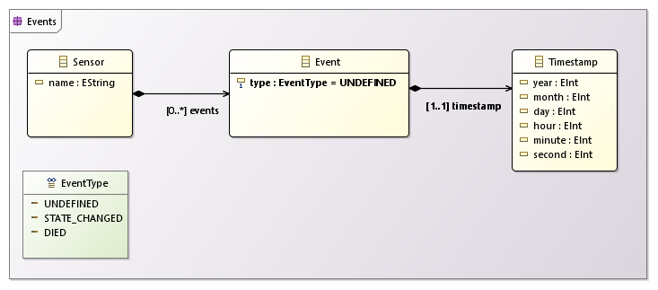
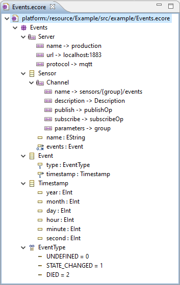

## Generating an AsyncAPI Specification from an Ecore model

It is possible to generate an skeleton _AsyncAPI Specification_ from an Ecore model.
The generator will create a reusable JSON Schema for each domain class.
Channels will be created out of annotated _EClasses_.
Moreover, hosts information can also be specified via _EAnnotations_. Currently, the following _EAnnotations_ are allowed:

| Ecore Element      | EAnnotation Source                                         | Description
| ------------------ | ---------------------------------------------------------- | -----------
| EPackage           | `http://io.github.abelgomez/asyncapi/eAnnotations/Server`  | List of Servers. Expect entries: `name` (Server name), `url` (Server url, including port) and `protocol` (AsyncAPI supported protocol).
| EClass             | `http://io.github.abelgomez/asyncapi/eAnnotations/Channel` | The EClass represents the Payload of a given Channel. Expected entries: `name` (Channel name), `description` (Channel description), `publish` (publish `operationId`), `subscribe` (subscribe `operationId`) and `parameters` (comma-separated list of parameters used in the Channel `name`, if any).
| EClass             | `http://io.github.abelgomez/asyncapi/eAnnotations/Message` | The EClass represents the Payload of a given Message. Expected entries: `name` (Message name).
| EClass             | `http://io.github.abelgomez/asyncapi/eAnnotations/Schema`  | The EClass represents a Payload. Expected entries: `name` (Schema name), `title` (friendly name of the Schema).
| EStructuralFeature | `http://io.github.abelgomez/asyncapi/eAnnotations/Schema`  | The EStructuralFeature is a property part of a Payload. Expected entries: `title` (friendly name for the property).

For example, starting from the following ecore class diagram:

It is possible to add the following annotations:

Run the _Example AsyncAPI Project from Ecore_ wizard to see how it works!
