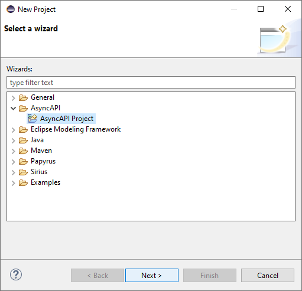

## Generating an AsyncAPI Specification from an annotated UML model

It is possible to generate an skeleton _AsyncAPI Specification_ from an annotated UML model.
For this, we provide an _Industry 4.0_ (I4.0) UML profile. In this page you'll find:

* [How did we create this model?](#how-did-we-create-this-model)
* [What does this profile look like?](#what-does-this-profile-look-like)
* [Do you provide any example?](#do-you-provide-any-example)
* [What can be generated out of an annotated UML model?](#what-can-be-generated-out-of-an-annotated-uml-model)
* [How can I test and play with this functionality?](#how-can-i-test-and-play-with-this-functionality)
* [Can I regenerate my AsyncAPI specification (and the generated code) after modifying the initial UML model?](#can-i-regenerate-my-asyncapi-specification-and-the-generated-code-after-modifying-the-initial-uml-model)
* [Where can I find the model transformations in the source code?](#where-can-i-find-the-model-transformations-in-the-source-code)

### How did we create this model?

UML is a powerful language that allows us to represent everything from the architecture to the behavioral aspects of software systems. However, when its expressiveness is too broad for a given context, it can be tailored for [specific purposes by profiling](https://doi.org/10.1109/ISORC.2007.10). A UML profile provides a set of stereotypes and tagged values that are added to UML models to extend their semantics. To build a UML profile, the application domain must be analyzed to identify its particularities. Following best practices, this analysis can be captured in a domain model. In our case, we have defined a _publish-subscribe_ model in Industry 4.0 for, subsequently and following the good practices of [Lagarde et al.](https://doi.org/10.1145/1321631.1321705) and [Selic](https://doi.org/10.1109/ISORC.2007.10), get a UML profile.

This is the domain model we have defined for the _Industry 4.0_ field:

[](/plugins/io.github.abelgomez.asyncapi.i40.profile/model/domain-model.png)

As can be seen, in an Industry 4.0 architecture we find at least one message _Broker_ in addition to the architecture components (_I4.0 Component_). A broker has a _name_, a URL (_url_), accepts a _protocol_, and may have a _description_. The architecture components define and execute _Operatiosn_. When a given operation publishes to a _Topic_ (which has a _name_, can have a _description_, and can be parameterized---see _parameters_), or is executed as a consequence of a subscription to a _topic_, becomes a _Publisher_ or a _Subscriber_ operation. A publisher operation sends a type of _Message_, just like a subscriber operation. Messages have a _name_, and can have a _description_, and a certain content (_Payload_). Said content is an object with a certain _value_ and that conforms to a certain _type_.

### What does this profile look like?

Starting from the previous model, and following the good practices indicated above, we have derived the UML profile below:

[](/plugins/io.github.abelgomez.asyncapi.i40.profile/model/i40.profile.png)


Thus, a UML model (_Model_ metaclass) can be annotated as an Industry 4.0 architecture using the _I4.0 Architecture_ stereotype. Using this stereotype, we can add metadata such as the name of the architecture (_name_), the _version_ of the specification, or a _description_. Likewise, UML components (metaclass _Component_) can be annotated as _I4.0 Component_ (to indicate that they are components of our Industry 4.0 architecture), or as _Broker_ (to indicate that they represent a broker). Brokers have the same properties as in the domain model (_name_, _url_, _protocol_, and _description_). Also, all components of Industry 4.0 must be associated with a broker.

The operations (_Operation_ metaclass) of an Industry 4.0 component can be annotated as _Publisher_ or _Subscriber_ to indicate that they publish to a _topic_, or are run by a subscription to a _topic_, via the _topic_ property. As in the domain model, a _Topic_  is a UML _Signal_. In this case, a _Signal_ annotated as a _Topic_ has a _name_, an optional _description_, an optional identifier of the publish and subscribe operations (_ publishOpId_ and _subscribeOpId_, respectively), and a set of _parameters_, which in turn can be named, typed, and can contain optional descriptions.
Note that the identifiers _publishOpId_ and _subscribeOpId_ do not necessarily have to coincide with the name of the operations of the components that publish or subscribe to a given _topic_, since a given _topic_ is going to be associated with numerous publisher and subscriber operations.
Next, we see that any UML _StructuredClassifier_ can be annotated to represent a certain _Message_.
Thus, a message has a _name_, and an optional _description_.
It should be noted that, since in the domain model a message points to a single _Payload_ whose type is a _StructuredClassifier_, the profile has avoided representing _Payload_ explicitly: the type of the _Payload_ is the _StructuredClassifier_ itself annotated by the message, and its value, the object resulting from instantiating said _StructuredClassifier_.
Finally, we find the _RedefinableProperty_ stereotype, which allows us to annotate properties (metaclass _Property_).
This is a helper stereotype that allows us to set a friendlier name, or _title_, to any property at the modeler's convenience.


### Do you provide any example?

Yes! Look at the model below!

[](/plugins/io.github.abelgomez.asyncapi.i40.ui/resources/example.i40.project/I40.png)

### What can be generated out of an annotated UML model?

From the above profiles model, it is possible to obtain the following AsyncAPI specification:

```js
{
{
	"asyncapi": "2.0.0",
	"info": {
		"title" : "Example Architecture",
		"version" : "0.1.0"
	},
	"servers": {
		"production" : {
			"url" : "example.com:1883",
			"protocol" : "mqtt"
		}
	},
	"channels": {
		"iotbox/{id}/monitor" : {
			"parameters" : {
				"id" : {
					"schema" : {
						"type" : "string"
					}
				}
			},
			"publish" : {
				"operationId" : "sendStatus",
				"message": {
					"$ref" : "#/components/messages/MonitorMessage"
				}
			},
			"subscribe" : {
				"operationId" : "receiveStatus",
				"message": {
					"$ref" : "#/components/messages/MonitorMessage"
				}
			}
		},
		"iotbox/{id}/configure" : {
			"parameters" : {
				"id" : {
					"schema" : {
						"type" : "string"
					}
				}
			},
			"publish" : {
				"operationId" : "sendServiceConfiguration",
				"message": {
					"$ref" : "#/components/messages/ConfigurationMessage"
				}
			},
			"subscribe" : {
				"operationId" : "receiveServiceConfiguration",
				"message": {
					"$ref" : "#/components/messages/ConfigurationMessage"
				}
			}
		}
	},
	"components": {
		"messages": {
			"MonitorMessage" : {
				"name" : "MonitorMessage",
				"payload" : {
					"$ref" : "#/components/schemas/PathInfo"
				}
			},
			"ConfigurationMessage" : {
				"name" : "ConfigurationMessage",
				"payload" : {
					"$ref" : "#/components/schemas/Configuration"
				}
			}
		},
		"schemas": {
			"Configuration" : {
				"type" : "object",
				"properties" : {
					"monitoringfrequency" : {
						"$ref" : "#/components/schemas/MonitoringFrequency"
					}
				}
			},
			"MonitoringFrequency" : {
				"type" : "object",
				"properties" : {
					"value" : {
						"type" : "integer"
					},
					"unit" : {
						"type" : "string",
						"enum" : [
							"seconds",
							"minutes"
						]
					}
				}
			},
			"PathInfo" : {
				"type" : "object",
				"properties" : {
					"id" : {
						"type" : "string"
					},
					"beltInfos" : {
						"type" : "array",
						"items" : {
							"$ref" : "#/components/schemas/BeltInfo"
						}
					}
				}
			},
			"BeltInfo" : {
				"type" : "object",
				"properties" : {
					"id" : {
						"type" : "string"
					},
					"ts" : {
						"type" : "string",
						"title" : "timestamp"
					},
					"speed" : {
						"type" : "integer"
					}
				}
			}
		}
	}
}
```

### How can I test and play with this functionality?

First, [Download and install the AsyncAPI Toolkit](Installation.md).

To see the above model, and test the transformation and the code generation, run the _Example AsyncAPI Project from I4.0 UML Model_.

First, use the dedicated wizard in the `New Project` dialog:



Second, _AsyncAPI Project_, set a project name, and continue.


Third, select the _Example AsyncAPI Project from I4.0 UML Model_ template.


Finally, the wizard can be completed.


After that, a new Maven project with the following contents will appear in the workspace.


Pay special attention to the following files:

* `src/main/java/example/I40.di` is the main Papyrus UML file with the example _Industry 4.0_ architecture [shown above](#do-you-provide-any-example).

* `src/main/java/example/I40.asyncapi` is the AsynAPI specification which is automatically generate from the UML model above. Code and other resourcs in the `gen` directory will be generated from the specification contained in this file.

* [`src/main/java/example/SubscribeExample.java`](/plugins/io.github.abelgomez.asyncapi.i40.ui/resources/example.i40.project/SubscribeExample.java) is an example program demonstrating how to use the generated code. In this case, this program subscribes to an example topic, and waits for messages until enter is pressed.

* [`src/main/java/example/PublishExample.java`](/plugins/io.github.abelgomez.asyncapi.i40.ui/resources/example.i40.project/PublishExample.java) is another example program. In this case, this program publishes messages in the example topic, one per each execution of the program. In can be executed at the same time than the `SubscribeExample.java` program, and messages sent by this program will be received by `SubscribeExample.java`.

### Where can I find the profile in the source code?

The profile can be found in the [/plugins/io.github.abelgomez.asyncapi.i40.profile/model/](/plugins/io.github.abelgomez.asyncapi.i40.profile/model/) directory. These are the main contents:

* [`domain-model.di`](/plugins/io.github.abelgomez.asyncapi.i40.profile/model/domain-model.di): Main Papyrus file for the [domain model](#how-did-we-create-this-model).
* [`domain-model.notation`](/plugins/io.github.abelgomez.asyncapi.i40.profile/model/domain-model.notation): Notation Papyrus file for the [domain model](#how-did-we-create-this-model)
* [`domain-model.uml`](/plugins/io.github.abelgomez.asyncapi.i40.profile/model/domain-model.uml): The actual UML2 file of the [domain model](#how-did-we-create-this-model)
* [`domain-model.png`](/plugins/io.github.abelgomez.asyncapi.i40.profile/model/domain-model.png): The [domain model](#how-did-we-create-this-model) as a PNG image file.
* [`i40.profile.di`](/plugins/io.github.abelgomez.asyncapi.i40.profile/model/i40.profile.di): Main Papyrus file for the [Industry 4.0 Profile](#what-does-this-profile-look-like).
* [`i40.profile.notation`](/plugins/io.github.abelgomez.asyncapi.i40.profile/model/i40.profile.notation): Notation Papyrus file for the [Industry 4.0 Profile](#what-does-this-profile-look-like).
* [`i40.profile.uml`](/plugins/io.github.abelgomez.asyncapi.i40.profile/model/i40.profile.uml): The actual UML2 file of the [Industry 4.0 Profile](#what-does-this-profile-look-like).
* [`i40.profile.png`](/plugins/io.github.abelgomez.asyncapi.i40.profile/model/i40.profile.png): The [Industry 4.0 Profile](#what-does-this-profile-look-like) as a PNG image.
* [`i40.ecore`](/plugins/io.github.abelgomez.asyncapi.i40.profile/model/i40.ecore): Automatically generated Ecore file from the [Industry 4.0 Profile](#what-does-this-profile-look-like). This Ecore file is used to generate code for the profile, so that it can be easily used in Java-based model transformations.
* [`i40.profile.genmodel`](/plugins/io.github.abelgomez.asyncapi.i40.profile/model/i40.profile.genmodel): Automatically generated GenModel file from the [Industry 4.0 Profile](#what-does-this-profile-look-like). This file is used to customize the code generation from the above Ecore file.

### Can I regenerate my AsyncAPI specification (and the generated code) after modifying the initial UML model?

Yes! But keep in mind that **any manual modifications to the I40.asyncapi file will be overwritten!**

Just use the `AsyncAPI -> Generate AsyncAPI` context menu over the `I40.uml` file:


### Where can I find the different transformations in the source code?

The integration of the _Industry 4.0 Profile_ within the _AsyncAPI Toolkit_ relies on two model transformations:

* _From UML to AsyncAPI_: This model-to-model transformation takes as its input a UML model annotation with the _Industry 4.0 Profile_, and generates an AsyncAPI specification based on its [abstract syntax](/plugins/io.github.abelgomez.asyncapi/model/generated/AsyncApi.ecore).

  This transformations, implemented using [Xtend](https://www.eclipse.org/xtend/), can be found at [/plugins/io.github.abelgomez.asyncapi.i40/src/io/github/abelgomez/asyncapi/i40/m2m/Uml2AsyncApi.xtend](/plugins/io.github.abelgomez.asyncapi.i40/src/io/github/abelgomez/asyncapi/i40/m2m/Uml2AsyncApi.xtend)

* _From AsyncAPI (model) to AsyncAPI (text)_: This model-to-text transformation takes as its input an AsyncAPI model and serializes it using its [JSON-based concrete syntax](https://www.asyncapi.com/docs/specifications/v2.0.0).

  This transformations, also implemented using [Xtend](https://www.eclipse.org/xtend/), can be found at [/plugins/io.github.abelgomez.asyncapi/src/io/github/abelgomez/asyncapi/generator/AsyncApi2Json.xtend](/plugins/io.github.abelgomez.asyncapi/src/io/github/abelgomez/asyncapi/generator/AsyncApi2Json.xtend)