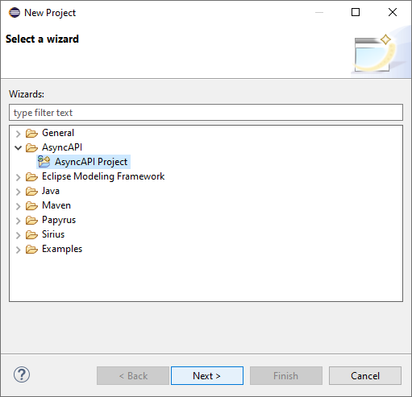
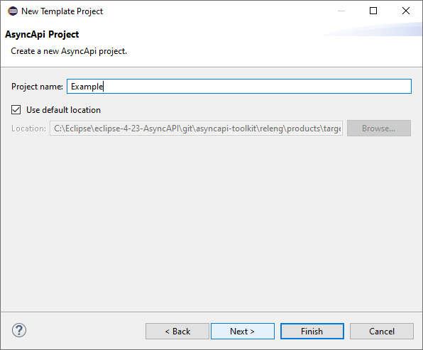
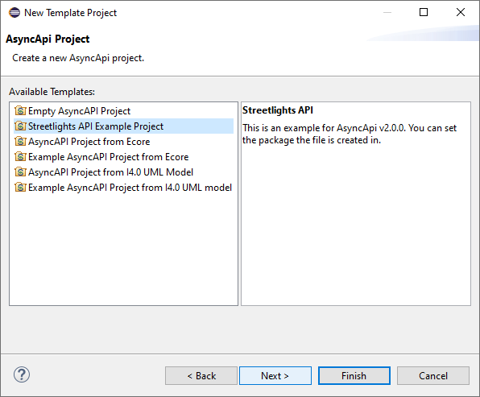
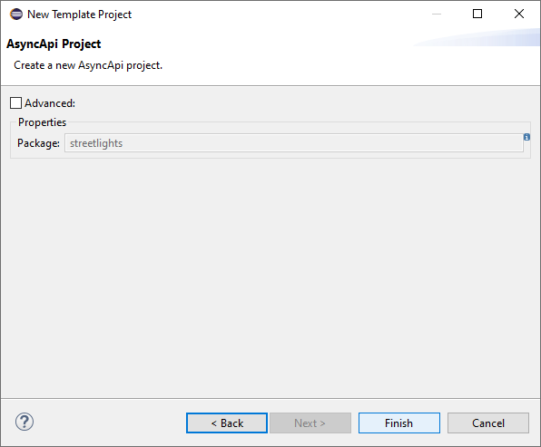
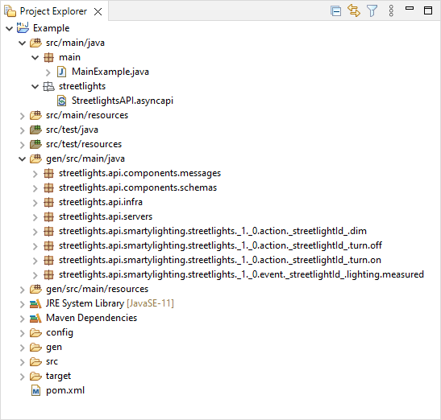

## Quick Start Guide

To get started with the _AsyncAPI Toolkit_, simply use the dedicated wizard in the `New Project` dialog:

Select _AsyncAPI Project_, set a project name, and continue.

After that, select a project template. We recommend you to start with the  _Streetlights API Example Project_. The _Streetlights API Example Project_ template contains a fully working example demonstrating the capabilities of the framework.

Finally, the wizard can be completed.

After that, a new Maven project with the following contents will appear in the workspace.

Pay special attention to the following files:

* [`src/main/java/streetlights/StreetlightsAPI.asyncapi`](/plugins/io.github.abelgomez.asyncapi.ui/resources/streetlights.project/StreetlightsAPI.asyncapi) is an example specification (see below) of an API using the JSON format of the AsyncAPI specification. Code and other resourcs in the `gen` directory will be generated from the specification contained in this file.

* [`src/main/java/main/MainExample.java`](/plugins/io.github.abelgomez.asyncapi.ui/resources/streetlights.project/MainExample.java) is an example program demonstrating how to use the generated code, which provides an internal DSL based on fluent APIs to generate messages, and to publish and subscribe them.

* [`src/test/java/main/TestMainExample.java`](/plugins/io.github.abelgomez.asyncapi.ui/resources/streetlights.project/TestMainExample.java) is an example test suite that uses an embedded MQTT server to show how the `MainExample.java` class can be executed.
